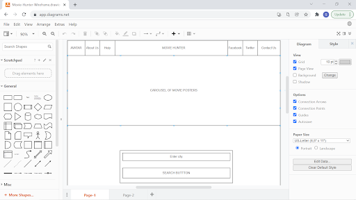
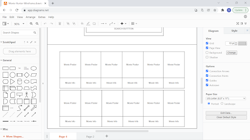
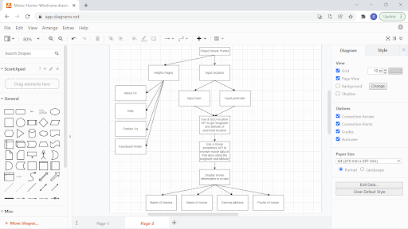

# Movie-Hunter
<h1>Movie Hunter!</h1>
<body>
This repository contains the source code for an awesome application named "Movie Hunter" !
This application can save you time and inform you of the hottest flicks at a location near you or abroad!

The application consists of a landing page with a NavBar containing links to the 'About us' page which has a short description of the team. There are also links to Twitter, Facebook as well as a link to another HTML page which allows the user to contact us by filling out a form.

The magic happens when the user inputs either their postcode or suburb/city into the form input and hits the search button. The search button then initiates the function (searchCity) which utilizes the Geoapify API to retreive the geometric coordinates of 
the location input by the user.

Once the geomatric data is obtained it is fed into the function getmovies function which gets the cinema information.
From the getmovies function the moviesrunningat function is called and all the information required is then written to the HTML with the createcard function.

 
 

<h2>Built With</h2>
<ul>
    <li>Vanilla.js</li>
    <li>jQuery</li>
    <li>international Showtimes</li>
    <li>Geoapify</li>
    <li>Bulma</li>
    <li>Font Awesome</li>
    <li>HTML 5</li>
    <li>CSS 4</li>
</ul>

 

<h2>URL:</h2>
 

<a href="https://hmughal71.github.io/Movie-Hunter/">https://hmughal71.github.io/Movie-Hunter/ </a>

 
<h2>Screenshot:</h2>

 

 

<h2>The Team</h2>
<ul>
    <h3>Patrick Brown</h3>
        <li><a href = https://www.linkedin.com/in/patrick-brown-52553410> LinkedIn </a></li>
    <li><a href = https://github.com/Pattiqus> GitHub </a></li>
    <li><a href = Patticus.tv@gmail.com>Email </a></li>
</ul>

<ul>
    <h3>Sean Scott</h3>
    <li><a href = https://www.linkedin.com/in/sean-scott-18ba07225>LinkedIn </a></li>
    <li><a href = https://github.com/seanscott95>GitHub </a></li>
    <li><a href = seanscott95@live.com>Email </a></li>     
</ul>

<ul>
    <h3>Bobby Cheema</h3>
        <li><a href = https://www.linkedin.com/in/patrick-brown-52553410> LinkedIn </a></li>
    <li><a href = https://github.com/bobby-cheema>GitHub </a></li>
    <li><a href = bobby1cheema@gmail.com@gmail.com>Email </a></li>
</ul>

<ul>
    <h3>Humayun Mughal</h3>
        <li><a href = https://www.linkedin.com/in/humayun-mughal-65771677>LinkedIn</a></li>
    <li><a href = https://github.com/hmughal71>GitHub</a></li>
    <li><a href = humayun_mughal@hotmail.com>Email</a></li>
</ul>
</body>
